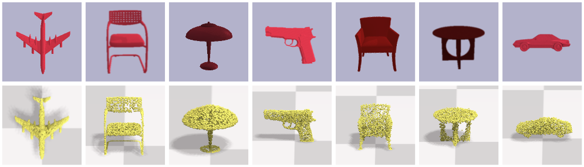
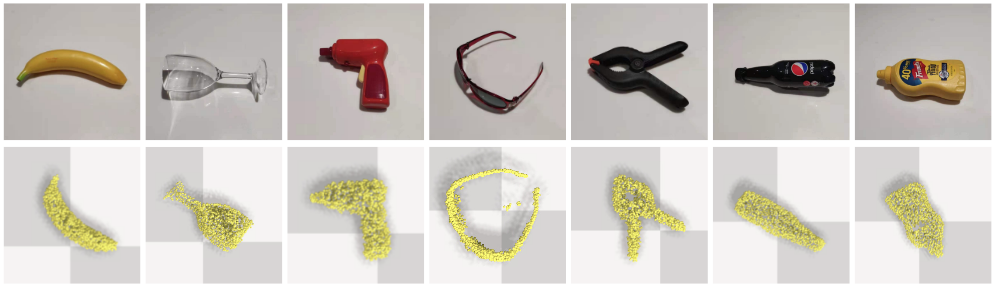

# Ab Initio Particle-based Object Manipulation

This repo contains the PyTorch implementation for the RSS 2021 paper.

Siwei Chen, Xiao Ma, Yunfan Lu and David
Hsu. [Ab Initio Particle-based Object Manipulation](https://arxiv.org/abs/2107.08865), *Robotics: Science and Systems*,
2021


#### Demos


#### Reconstruction



#### Reconstruction in real world




## Setup
- Install [docker-ce](https://docs.docker.com/install/linux/docker-ce/ubuntu/)
- Install [nvidia-docker](https://github.com/NVIDIA/nvidia-docker#quickstart)
- Install [Anaconda](https://www.anaconda.com/distribution/)

We provide additional requirements.txt

```
conda create -n prompt python==3.6.8
conda activate prompt
pip install -r requirements.txt
conda install pybind11
conda install pytorch torchvision cudatoolkit=11.1 -c pytorch -c nvidia
```

### Install Gym Env with PyBullet

```
pip install -e gym_env/
```

### Install PyFlex

```
docker pull adacomplab/prompt_flex

docker run \
  -v "$(pwd)"/PyFlexEngine/:/workspace/PyFleX \
  -v ~/anaconda3/envs/prompt/:/workspace/anaconda \
  -it adacomplab/prompt_flex
  
# in the docker image, to build prompt_pyflex
cd ~
export PATH="/workspace/anaconda/bin:$PATH"
cd /workspace/PyFleX
export PYFLEXROOT=${PWD}
export PYTHONPATH=${PYFLEXROOT}/bindings/build:$PYTHONPATH
export LD_LIBRARY_PATH=${PYFLEXROOT}/external/SDL2-2.0.4/lib/x64:$LD_LIBRARY_PATH
cd bindings; mkdir build; cd build; cmake ..; make -j

```
Exit docker, and change Path_To_Prompt below. 
You can add below lines to .bashrc and source it. 
```
export PYFLEXROOT=Path_To_Prompt/PyFlexEngine
export PYTHONPATH=${PYFLEXROOT}/bindings/build:$PYTHONPATH
export LD_LIBRARY_PATH=${PYFLEXROOT}/external/SDL2-2.0.4/lib/x64:$LD_LIBRARY_PATH
```
## To Run
```
# start planning service
# you may reduce the num_workers, if out of memory occurs
# you can set "--visualize_flex 0" to run planning headlessly and speed up planning.
python core/planning/grasp/grasp_plan_service.py --gpu_id 0 --num_workers 20 --visualize_flex 1

# if you have multiple gpus
# CUDA_VISIBLE_DEVICES=1 python core/planning/grasp/grasp_plan_service.py --gpu_id 1 --num_workers 20
# CUDA_VISIBLE_DEVICES=2 python core/planning/grasp/grasp_plan_service.py --gpu_id 2 --num_workers 20

# start grasping demo
# you can set "--visualize_pybullet 0" to run robot simulation headlessly in pybullet.
# grasping screenshots are also saved in core/app/grasp/data_folder/
python core/app/grasp/main_grasp.py --num_gpu 1 --visualize_pybullet 1
```


Acknowledgements
----------------

The Prompt uses code from the following libraries:

* [Nvidia Flex](https://developer.nvidia.com/flex) Particle based simulation.
* [PyFlex](https://github.com/YunzhuLi/PyFleX) Python Interface for Nvidia Flex.
* [PyBullet](https://github.com/bulletphysics/bullet3) Robot simulation.
* [3DNet](https://berkeley.app.box.com/s/w6bmvvkp399xtjpgskwq1cytkndmm7cn/file/196419701313) 3DNet Object Mesh Models Processed by the Dexterity Network for demo purpose.

